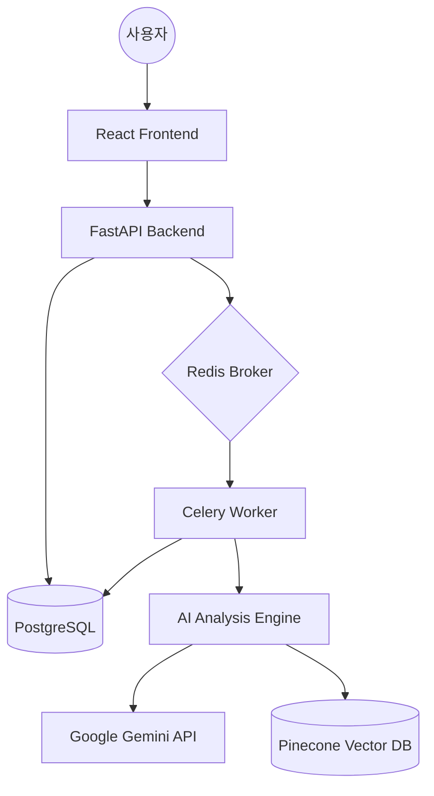

# StoryProof 시스템 아키텍처 및 작동 원리 안내

StoryProof는 AI 기술을 활용하여 소설의 일관성을 검증하고 독자들에게 깊이 있는 해설을 제공하는 웹 애플리케이션입니다. 전체 시스템은 크게 **Frontend**, **Backend API**, **AI Analysis Engine**, **Async Worker**, **Storage**의 5개 레이어로 구성되어 있습니다.

## 1. 전체 데이터 흐름 (Data Flow)

---

## 2. 주요 레이어별 파일 설명

### 🎨 Frontend (Vite + React + TypeScript)
- **`frontend/src/App.tsx`**: 애플리케이션의 입구입니다. 페이지 라우팅과 사용자 인증 상태를 관리합니다.
- **`frontend/src/components/Dashboard.tsx`**: 로그인 후 첫 화면입니다. **작가/독자 모드**에 따라 다른 도구(카드)를 동적으로 보여줍니다.
- **`frontend/src/components/ChapterDetail.tsx`**: 실제 소설을 읽거나 쓰는 핵심 화면입니다. **AI 어휘 사전(드래그)** 기능과 **실시간 분석** 요청이 여기서 일어납니다.
- **`frontend/src/api/`**: 백엔드 서버와 통신하기 위한 Axios 요청 함수들이 모여 있습니다.

### ⚙️ Backend API (FastAPI)
- **`backend/main.py`**: 서버의 시작점입니다. 데이터베이스 연결, CORS 설정, API 경로 등록을 수행합니다.
- **`backend/api/v1/endpoints/`**: 
    - `auth.py`: 회원가입, 로그인 등 사용자 인증 처리.
    - `novel.py`: 소설 생성, 목록 조회, 챕터 데이터 관리.
    - `analysis.py`: 배경 작업(분석) 요청 및 결과 조회.
- **`backend/db/models.py`**: 데이터베이스 테이블(User, Novel, Chapter, Bible 등)의 구조를 정의합니다.

### 🧠 AI Analysis Engine (AI 엔진)
- **`backend/services/analysis/document_loader.py`**: 소설 텍스트를 깨끗하게 다듬고 읽어오는 역할을 합니다.
- **`backend/services/analysis/scene_chunker.py`**: 긴 소설 텍스트를 의미 있는 장면(Scene) 단위로 쪼갭니다.
- **`backend/services/analysis/gemini_structurer.py`**: Google Gemini를 사용하여 인물, 사건, 장소 등 핵심 정보를 추출하여 '소설 성경(Bible)' 데이터를 만듭니다.
- **`backend/services/analysis/embedding_engine.py`**: 소설 내용을 벡터(숫자)로 변환하여 **Pinecone**에 저장하고, 유사한 내용을 검색합니다.

### 🏃 Async Worker (비동기 작업)
- **`backend/worker/celery_app.py`**: 오래 걸리는 AI 분석 작업을 백그라운드에서 실행하기 위한 Celery를 설정합니다.
- **`backend/worker/tasks.py`**: 실제 분석 로직(`process_chapter_storyboard`)이 담겨 있습니다. 사용자가 '분석' 버튼을 누르면 여기서 작업이 시작됩니다.

### 💾 Storage (저장소)
- **PostgreSQL**: 사용자의 계정 정보, 소설 텍스트, 추출된 인물 정보 등 영구적인 데이터를 저장합니다.
- **Pinecone**: 소설의 내용(벡터)을 저장하여 나중에 AI가 유사한 문맥을 빠르게 찾을 수 있게 합니다. (플롯홀 탐지의 핵심)
- **Redis**: 백엔드 API와 워커 사이의 작업 메시지를 중계하는 속도감 있는 저장소입니다.

---

## 3. 핵심 기능 작동 과정 (예: 소설 분석)

1. **사용자**: 대시보드에서 '분석' 버튼을 클릭합니다.
2. **API (`analysis.py`)**: Celery 워커에게 작업을 던지고 사용자에게 '진행 중' 상태를 반환합니다.
3. **Worker (`tasks.py`)**:
   - `scene_chunker`로 장면을 쪼개고,
   - `gemini_structurer`로 핵심 정보를 뽑아 DB에 저장하고,
   - `embedding_engine`으로 텍스트를 Pinecone에 업로드합니다.
4. **결과**: 작업이 끝나면 DB의 상태가 `COMPLETED`로 바뀌고, 사용자는 화면에서 분석 보고서를 볼 수 있게 됩니다.

이 구조는 시스템 부하를 분산시키고(Worker), 텍스트의 의미를 이해하며(AI 엔진), 대용량 데이터도 빠르게 가공할 수 있도록 설계되었습니다.

-----------------------------------------------------------------------------------------------------------------------------------------
