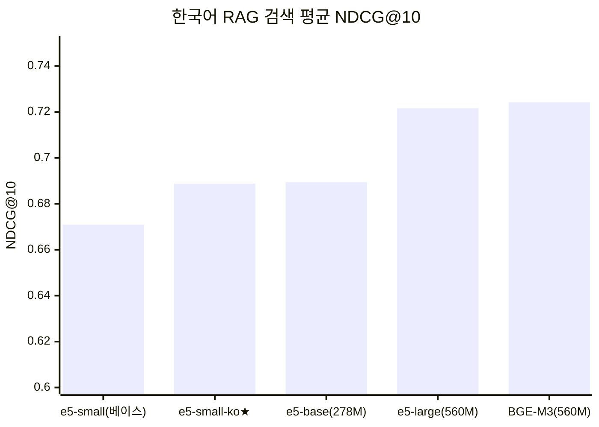
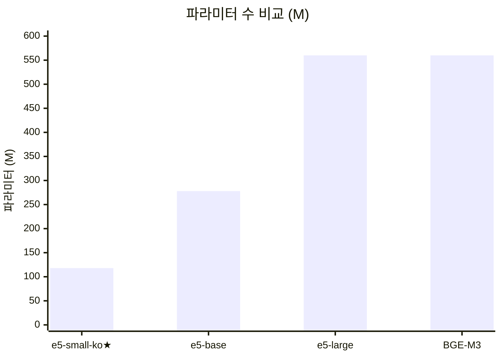
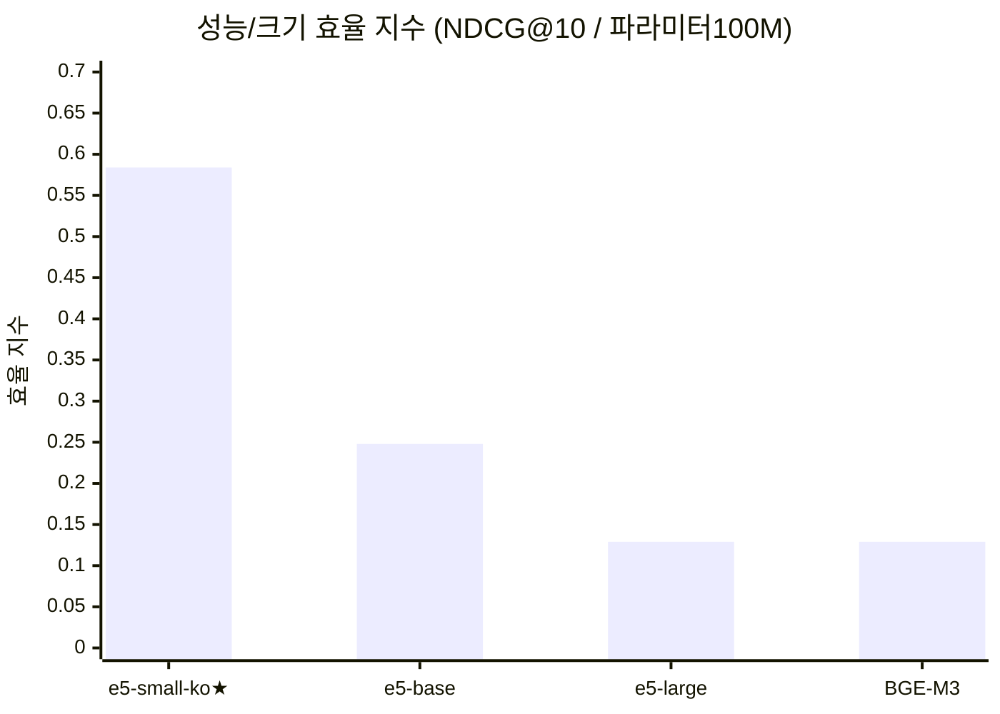
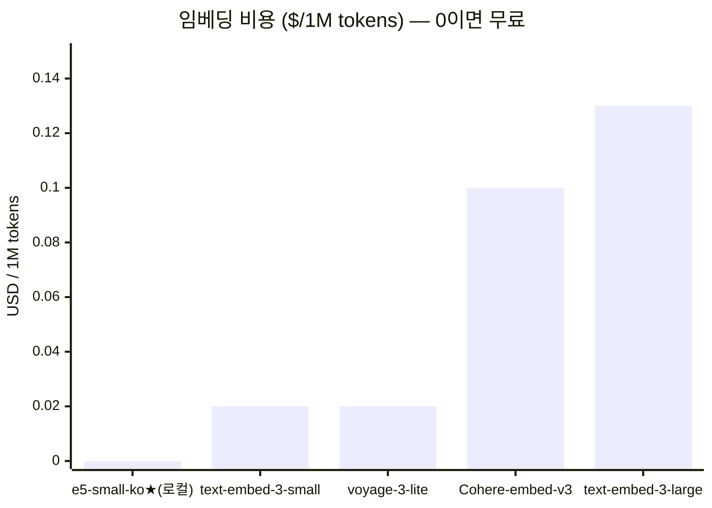
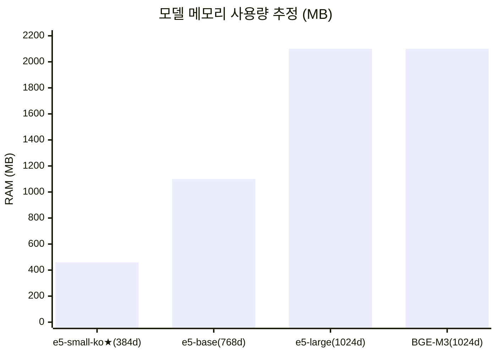
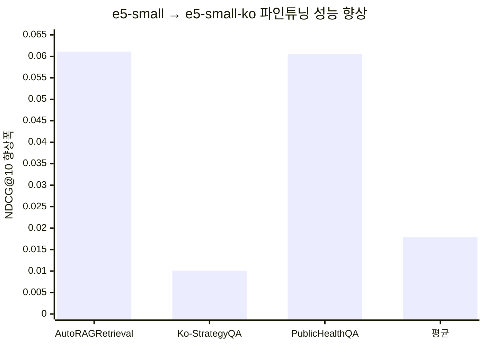

# 임베딩 모델 선택 근거 — dragonkue/multilingual-e5-small-ko

> 작성일: 2026-02-23
> 사용 위치: RAG 검색 파이프라인 (Dense Retrieval), Pinecone 벡터 인덱스

---

## 1. StoryProof에서 임베딩 모델의 역할

```
사용자 질문
    │
    ▼
[임베딩 모델] → 384차원 벡터 생성
    │
    ├─ 질문 벡터 → Pinecone 검색 (Dense)
    │
    └─ 씬 인덱싱 → Pinecone 저장 (챕터 업로드 시)
```

임베딩 모델은 두 시점에 호출됩니다:
- **인덱싱 시**: 챕터 업로드 → 씬 분할 → 각 씬을 벡터화 → Pinecone 저장
- **검색 시**: 사용자 질문 → 벡터화 → Pinecone 유사도 검색 (실시간)

---

## 2. 현재 모델 사양

| 항목 | 값 |
|---|---|
| **모델 ID** | `dragonkue/multilingual-e5-small-ko` |
| **파라미터** | 118M (0.1B) |
| **임베딩 차원** | 384 |
| **최대 입력 길이** | 512 tokens |
| **아키텍처** | Sentence-BERT (BERT 기반) |
| **파인튜닝 기반** | `intfloat/multilingual-e5-small` |
| **학습 방법** | GISTEmbedLoss + in-batch negatives |
| **라이선스** | MIT (상업적 사용 가능) |
| **운용 방식** | 로컬 서버 탑재 (API 호출 없음) |

---

## 3. 한국어 검색 성능 비교 (NDCG@10)

> NDCG@10: 상위 10개 검색 결과의 정확도. 1.0이 최고.



| 모델 | 파라미터 | 평균 NDCG@10 | AutoRAG | Ko-StrategyQA | MIRACL | PublicHealth |
|---|---|---|---|---|---|---|
| intfloat/multilingual-e5-small | 118M | 0.6709 | 0.8007 | 0.7516 | 0.6124 | 0.7367 |
| **dragonkue/e5-small-ko** | **118M** | **0.6888** | **0.8618** | **0.7617** | 0.6111 | **0.7973** |
| intfloat/multilingual-e5-base | 278M | 0.6894 | 0.7975 | 0.7636 | 0.6227 | 0.7720 |
| intfloat/multilingual-e5-large | 560M | 0.7216 | 0.8134 | 0.8035 | 0.6649 | 0.8253 |
| BAAI/bge-m3 | 560M | 0.7242 | 0.8301 | 0.7941 | 0.7015 | 0.8041 |

> **핵심**: e5-small-ko(118M)는 **e5-base(278M, 2.4× 큰 모델)와 동등한 성능** (0.6888 vs 0.6894)

---

## 4. 모델 크기 vs 성능 효율





> 효율 지수 = NDCG@10 ÷ (파라미터수/100M) — e5-small-ko가 **4.5× 높은 효율**

---

## 5. 비용 비교 — API 임베딩 모델 대비



| 모델 | 비용 (/1M tokens) | 운용 방식 | 데이터 전송 |
|---|---|---|---|
| **dragonkue/e5-small-ko** | **$0 (무료)** | 로컬 서버 | 없음 (자체 처리) |
| OpenAI text-embedding-3-small | $0.02 | API | 외부 전송 |
| Voyage-3-lite | $0.02 | API | 외부 전송 |
| Cohere Embed v3 Multilingual | $0.10 | API | 외부 전송 |
| OpenAI text-embedding-3-large | $0.13 | API | 외부 전송 |

### 실사용 비용 시뮬레이션

> 가정: 챕터 100개 인덱싱 + 일 500회 검색 질문 (월 기준)

| 모델 | 인덱싱 (100챕터 × 20K tokens) | 검색 (500/일 × 30일 × 50tokens) | **월 합계** |
|---|---|---|---|
| **e5-small-ko (로컬)** | **$0** | **$0** | **$0** |
| text-embedding-3-small | $0.04 | $0.015 | $0.055 |
| Cohere Embed v3 | $0.20 | $0.075 | $0.275 |
| text-embedding-3-large | $0.26 | $0.098 | $0.358 |

> 소액이지만 **누적 쿼리 증가 시 비용이 선형 증가** → 로컬 모델은 트래픽에 무관

---

## 6. 운용 환경 적합성 (GCP e2-standard-2)



| 항목 | e5-small-ko | e5-base | e5-large / BGE-M3 |
|---|---|---|---|
| 모델 RAM | ~460MB | ~1.1GB | ~2.1GB |
| 추론 속도 | **16ms** | ~35ms | ~80-100ms |
| e2-standard-2 8GB 여유 | ✅ 충분 | ✅ 가능 | ⚠️ 백엔드+Celery와 병행 시 빠듯 |

> **서버 환경**: GCP e2-standard-2 (8GB RAM) — gunicorn 1 worker + Celery + E5 모델이 공존
> e5-small-ko의 460MB는 전체 서버 운용에 가장 안전한 선택

---

## 7. 한국어 특화 파인튜닝 효과

### 베이스 모델 대비 성능 향상 (NDCG@10)



| 벤치마크 | e5-small (베이스) | e5-small-ko | **향상** |
|---|---|---|---|
| AutoRAGRetrieval | 0.8007 | **0.8618** | **+0.0611 (+7.6%)** |
| Ko-StrategyQA | 0.7516 | **0.7617** | **+0.0101 (+1.3%)** |
| PublicHealthQA | 0.7367 | **0.7973** | **+0.0606 (+8.2%)** |
| XPQARetrieval | 0.3300 | **0.3487** | **+0.0187 (+5.7%)** |
| 전체 평균 | 0.6709 | **0.6888** | **+0.0179 (+2.7%)** |

> 학습 방법: **GISTEmbedLoss** (일반 MNR Loss 대비 +1.5 NDCG@10 추가 향상)

---

## 8. API 모델 대비 추가 장점

| 항목 | API 임베딩 (OpenAI 등) | **e5-small-ko (로컬)** |
|---|---|---|
| 데이터 프라이버시 | ❌ 소설 원문이 외부 서버 전송 | ✅ 서버 내부 처리 |
| 인터넷 의존성 | ❌ API 장애 시 서비스 중단 | ✅ 오프라인 가능 |
| 응답 지연 | ❌ 네트워크 RTT + API 처리 | ✅ 16ms 로컬 추론 |
| Rate Limit | ❌ 분당 요청 제한 존재 | ✅ 제한 없음 |
| 버전 고정 | ❌ API 모델 업데이트로 임베딩 공간 변화 | ✅ 모델 버전 고정 가능 |
| 비용 예측성 | ❌ 트래픽 증가 = 비용 증가 | ✅ 고정 비용 (서버 비용만) |

> 소설 저작물 특성상 **저작권 민감 원문이 외부 API로 전송되지 않는 것**이 중요

---

## 9. 코사인 유사도 특성 (운용 주의사항)

E5 모델 계열은 코사인 유사도 분포가 일반 모델과 다릅니다:

```
일반 임베딩:    [0.0 ─── 0.4 ─── 0.7 ─── 1.0]
                 무관     보통     관련     동일

E5 모델(한국어): [0.7 ─── 0.8 ─── 0.9 ─── 1.0]
                 무관*    보통     관련     동일
```

> `*` 완전히 무관한 질문도 0.77+ 나올 수 있음 (정규화 효과)
> → StoryProof RAG에서 `ITERATIVE_RETRIEVAL_THRESHOLD = 0.79` 설정의 이유

---

## 10. 종합 결론

```
선택 이유 요약
─────────────────────────────────────────────────────
① 성능: e5-base(278M, 2.4× 크기)와 동등한 한국어 NDCG@10
② 비용: API 임베딩 대비 완전 무료 (월 ~$0.06~$0.36 절감)
③ 서버: 460MB RAM으로 8GB GCP 서버에서 안정 운용
④ 속도: 16ms 로컬 추론 vs API 네트워크 RTT
⑤ 보안: 소설 원문이 외부 서버로 나가지 않음
⑥ 안정: API 장애·Rate Limit·버전 변경 영향 없음
```

**상위 모델(e5-large, BGE-M3)과의 트레이드오프**:
- NDCG@10 약 0.035 낮음 (0.6888 vs 0.7242)
- 파라미터 4.7× 적음, RAM 4.5× 절약
- 서버 환경(8GB RAM, 저비용)에서 상위 모델 탑재 시 **메모리 부족 또는 서비스 불안정** 위험

---

## 참고 자료

- [dragonkue/multilingual-e5-small-ko — Hugging Face](https://huggingface.co/dragonkue/multilingual-e5-small-ko)
- [dragonkue/multilingual-e5-small-ko-v2 — Hugging Face](https://huggingface.co/dragonkue/multilingual-e5-small-ko-v2)
- [Multilingual E5 Technical Report — arxiv](https://arxiv.org/abs/2402.05672)
- [OpenAI Embedding Pricing](https://openai.com/api/pricing/)
- [Voyage AI Pricing](https://docs.voyageai.com/docs/pricing)
- [Best Embedding Models 2025 — Ailog RAG](https://app.ailog.fr/en/blog/guides/choosing-embedding-models)
- [AutoRAG Korean Embedding Benchmark — GitHub](https://github.com/Marker-Inc-Korea/AutoRAG-example-korean-embedding-benchmark)
