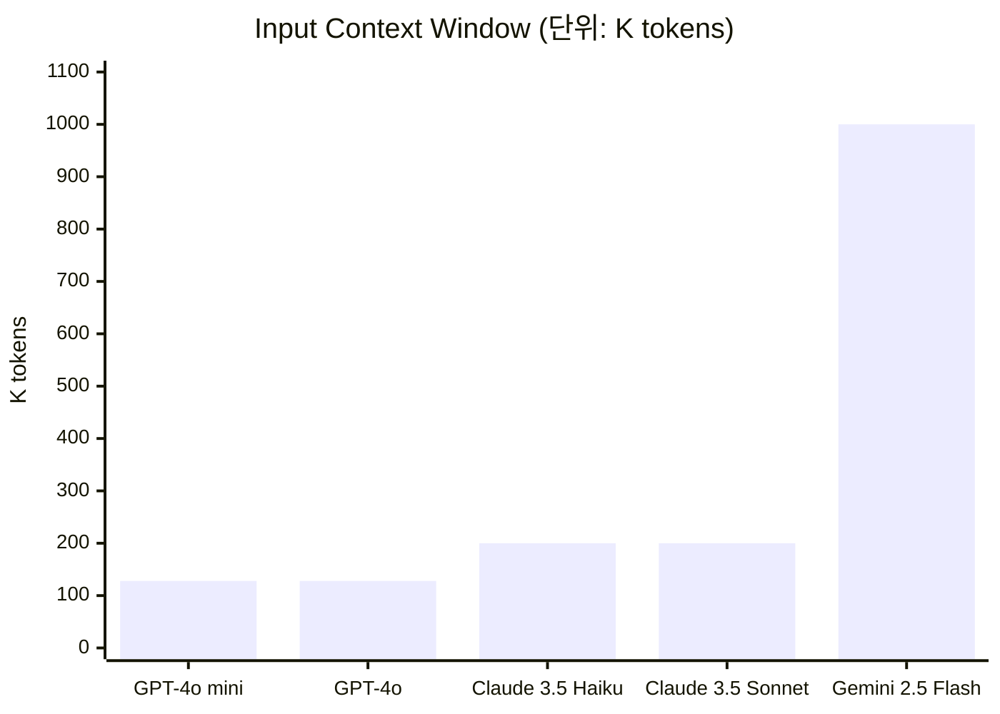
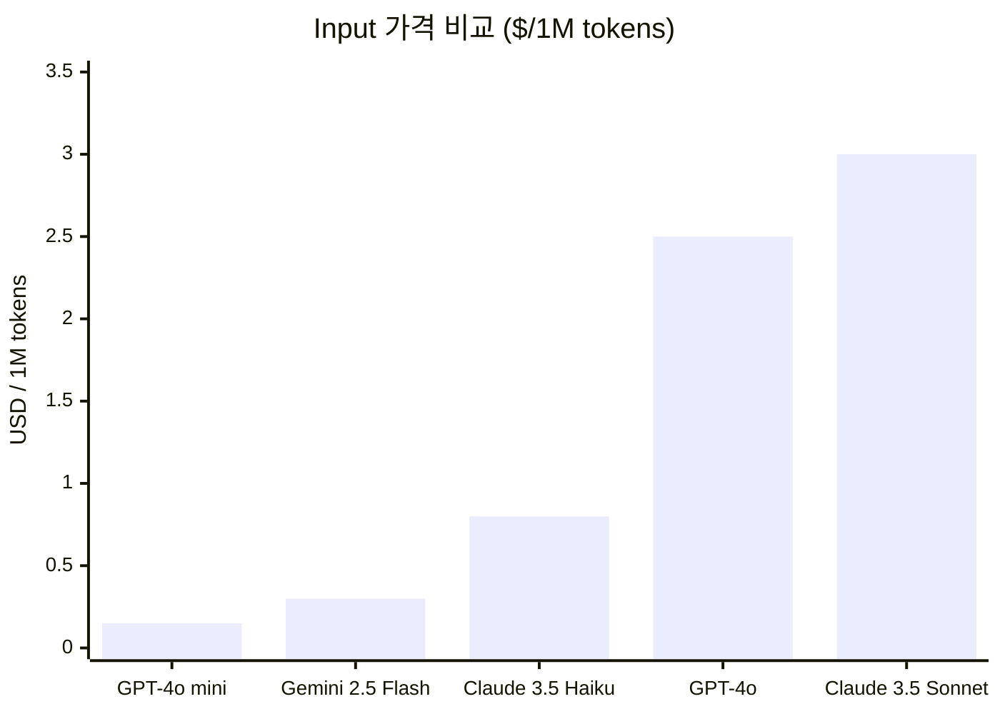
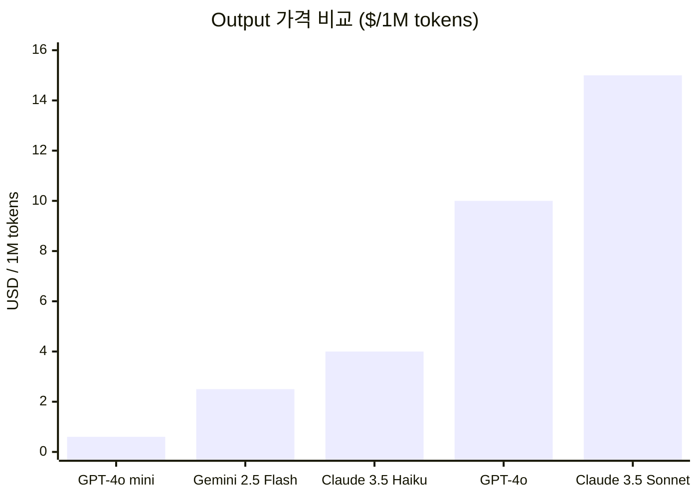
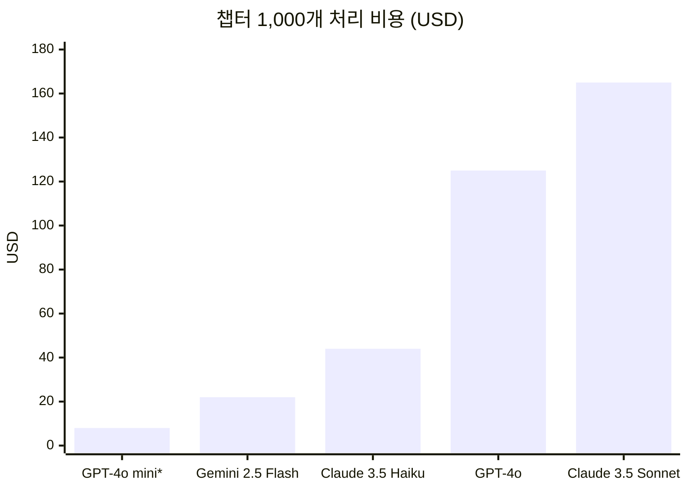
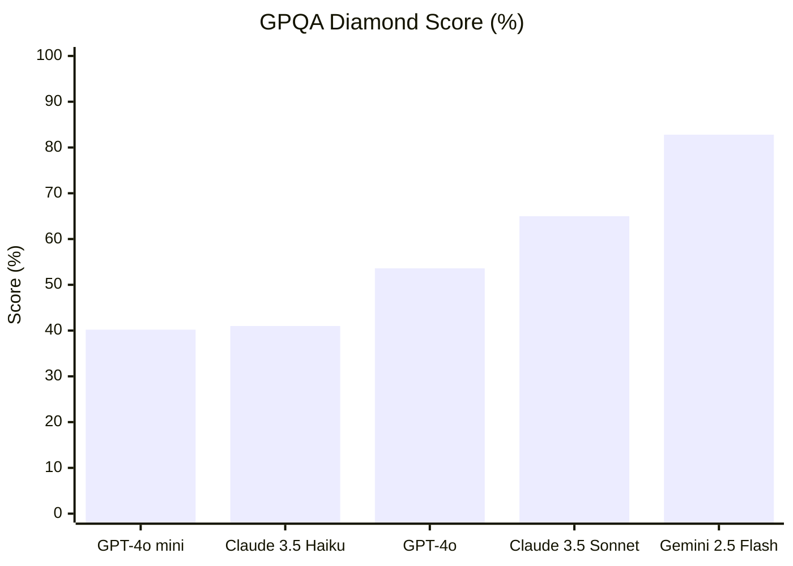
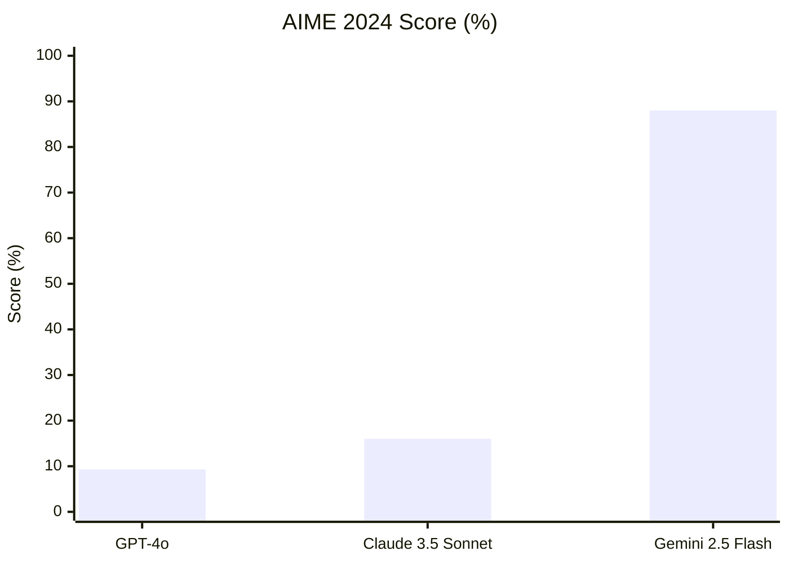
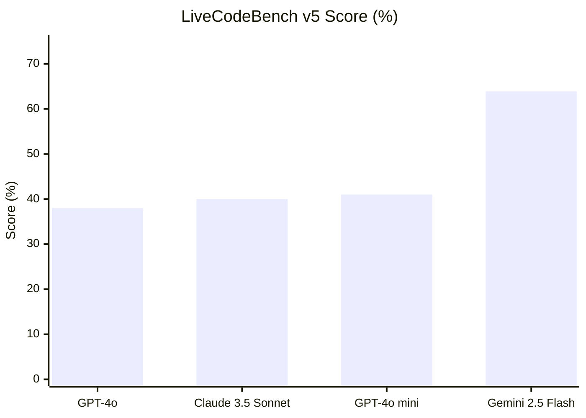
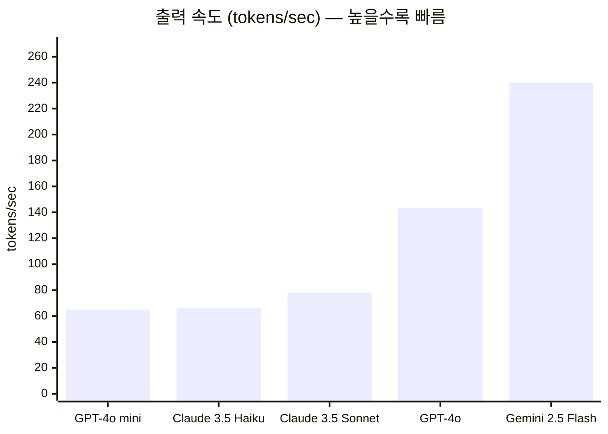

# Gemini 2.5 Flash 선택 근거 — 정량적 비교 분석

> 작성일: 2026-02-23
> 대상 모델: `gemini-2.5-flash` (구조화·챗봇·분석), `gemini-2.0-flash` (이미지 프롬프트 정제)

---

## 1. StoryProof 내 사용처

| 역할 | 설정 키 | 요구 특성 |
|---|---|---|
| 씬 구조화 (GeminiStructurer) | `GEMINI_STRUCTURING_MODEL` | 장편 챕터 전문 파싱, JSON 추출 |
| RAG 챗봇 응답 생성 | `GEMINI_CHAT_MODEL` | 검색 컨텍스트 + 대화 이력 유지 |
| 스토리 일관성 분석 | `GEMINI_STRUCTURING_MODEL` | 다수 씬 교차 비교, 논리 추론 |
| 이미지 프롬프트 정제 | `GEMINI_REFINE_MODEL` | 단순 텍스트 변환 (2.0 Flash 사용) |

---

## 2. 컨텍스트 윈도우 비교



| 모델 | Context Window | 대략 분량 | StoryProof 적합성 |
|---|---|---|---|
| GPT-4o / GPT-4o mini | 128K 토큰 | A4 약 90페이지 | ⚠️ 장편 챕터에서 초과 위험 |
| Claude 3.5 Sonnet / Haiku | 200K 토큰 | A4 약 140페이지 | ⚠️ 중편 소설까지 안정 |
| **Gemini 2.5 Flash** | **1,000K 토큰** | **A4 약 700페이지** | ✅ 장편 소설 1권 전체 처리 가능 |

> 소설 챕터 전문을 단일 프롬프트로 투입하는 구조에서 128K는 분할 처리가 필요해 호출 횟수·비용·오류 가능성이 모두 증가합니다.

---

## 3. 비용 비교

### 3-1. 토큰당 단가





| 모델 | Input ($/1M) | Output ($/1M) | Flash 대비 Input | Flash 대비 Output |
|---|---|---|---|---|
| GPT-4o mini | $0.15 | $0.60 | 0.5× (더 저렴) | 0.24× |
| **Gemini 2.5 Flash** | **$0.30** | **$2.50** | **기준** | **기준** |
| Claude 3.5 Haiku | $0.80 | $4.00 | 2.7× | 1.6× |
| GPT-4o | $2.50 | $10.00 | 8.3× | 4× |
| Claude 3.5 Sonnet | $3.00 | $15.00 | 10× | 6× |

### 3-2. 실사용 비용 시뮬레이션

> **가정**: 챕터 1개 = 씬 구조화 (input 30K + output 5K) × 10씬 처리



> `*` GPT-4o mini: 단가는 최저이나 128K 컨텍스트 한계로 장편 챕터 분할 처리 시 호출 수 증가 → 실비용 역전 가능.

---

## 4. 성능 벤치마크

### 4-1. GPQA Diamond (대학원급 과학 추론)



### 4-2. 수학 추론 — AIME 2024



### 4-3. 코딩 — LiveCodeBench v5



### 4-4. 종합 벤치마크 비교표

| 벤치마크 | 측정 능력 | GPT-4o mini | GPT-4o | Claude 3.5 Sonnet | **Gemini 2.5 Flash** |
|---|---|---|---|---|---|
| Global-MMLU-Lite | 종합 지식 | ~82% | ~88.7% | ~88.7% | **88.4%** |
| GPQA Diamond | 과학 추론 | ~40.2% | ~53.6% | ~65.0% | **82.8%** |
| AIME 2024 | 수학 | 미공개 | ~9.3% | ~16.0% | **88.0%** |
| AIME 2025 | 수학 | 미공개 | 미공개 | 미공개 | **72.0%** |
| LiveCodeBench v5 | 실전 코딩 | ~41% | ~38% | ~40% | **63.9%** |
| SWE-Bench Verified | SW 엔지니어링 | 미공개 | ~33% | ~49% | **60.4%** |
| MMMU | 멀티모달 이해 | 미공개 | ~69.1% | ~70% | **79.7%** |
| FACTS Grounding | 사실 기반 응답 | - | - | - | **85.3%** |

---

## 5. 응답 속도 비교



| 모델 | 출력 속도 (t/s) | 첫 토큰 지연 |
|---|---|---|
| **Gemini 2.5 Flash** | **240.1** ✅ | **0.38s** |
| GPT-4o | 143 | ~0.5s |
| Claude 3.5 Sonnet | 78 | ~0.7s |
| Claude 3.5 Haiku | 66 | ~0.5s |
| GPT-4o mini | 65 | ~0.5s |

> 스트리밍 챗봇 특성상 240 t/s는 사용자가 체감하는 응답 품질에 직결됩니다.

---

## 6. 종합 포지셔닝

```mermaid
quadrantChart
    title 성능 vs 비용 효율 포지셔닝
    x-axis 비싸다 --> 저렴하다
    y-axis 낮은성능 --> 높은성능
    quadrant-1 고성능·저비용 (최적)
    quadrant-2 고성능·고비용
    quadrant-3 저성능·고비용
    quadrant-4 저성능·저비용
    GPT-4o: [0.15, 0.55]
    Claude 3.5 Sonnet: [0.1, 0.65]
    Claude 3.5 Haiku: [0.35, 0.40]
    GPT-4o mini: [0.8, 0.38]
    Gemini 2.5 Flash: [0.7, 0.85]
```

| 기준 | GPT-4o mini | **Gemini 2.5 Flash** | Claude 3.5 Sonnet |
|---|---|---|---|
| 컨텍스트 윈도우 | ❌ 128K | ✅ **1M (8×)** | ⚠️ 200K |
| 입력 단가 | ✅ $0.15 (최저) | ✅ $0.30 | ❌ $3.00 (10×) |
| 추론 성능 (GPQA) | ❌ 40.2% | ✅ **82.8%** | ⚠️ 65% |
| 수학 추론 (AIME) | ❌ 미공개 | ✅ **88%** | ❌ 16% |
| 응답 속도 | ❌ 65 t/s | ✅ **240 t/s** | ❌ 78 t/s |
| 멀티모달 | ⚠️ 텍스트+이미지 | ✅ 텍스트+이미지+음성+영상 | ⚠️ 텍스트+이미지 |
| 한국어 구조화 | ⚠️ 보통 | ✅ 우수 (Google 다국어) | ⚠️ 보통 |

---

## 7. 결론

Gemini 2.5 Flash 선택의 핵심은 **세 지표가 동시에 최적점**에 있다는 점입니다:

```
① Context 1M  →  장편 소설 챕터 전체를 단일 프롬프트로 처리 (분할 없음)
② 성능 GPQA 82.8%  →  GPT-4o($2.50/M)보다 추론이 앞서면서 비용은 1/8
③ 속도 240 t/s  →  스트리밍 챗봇 체감 품질 직결
```

**GPT-4o mini**는 단가($0.15/M)가 유일하게 더 낮지만:
- 128K 컨텍스트로 장편 챕터 분할 처리 필요 → 호출 수 증가 → 실비용 역전
- GPQA 40.2% → Gemini 2.5 Flash(82.8%) 대비 절반 이하 → 논리 일관성 분석 부적합

---

## 참고 자료

- [Artificial Analysis — Gemini 2.5 Flash](https://artificialanalysis.ai/models/gemini-2-5-flash)
- [llm-stats.com — Gemini 2.5 Flash](https://llm-stats.com/models/gemini-2.5-flash)
- [Vellum LLM Leaderboard 2025](https://www.vellum.ai/llm-leaderboard)
- [IntuitionLabs — AI API Pricing Comparison 2026](https://intuitionlabs.ai/articles/ai-api-pricing-comparison-grok-gemini-openai-claude)
- [pricepertoken.com — Gemini 2.5 Flash](https://pricepertoken.com/pricing-page/model/google-gemini-2.5-flash)
